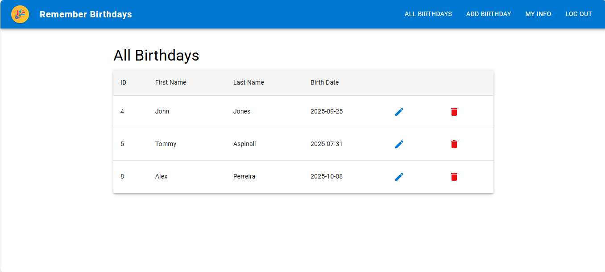
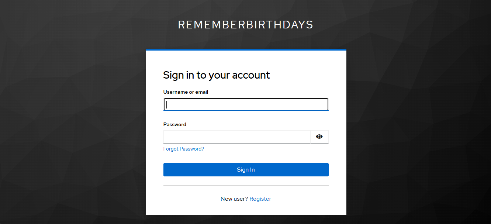

# RememberBirthdays – Frontend

> React + TypeScript frontend for RememberBirthdays, a full-stack web app with a Spring Boot backend and Keycloak authentication. Deployed on **AWS S3**.

---

## Table of Contents

1. [Project Overview](#project-overview)
2. [Tech Stack](#tech-stack)
3. [Features](#features)
4. [Project Structure](#project-structure)
5. [Screenshots](#screenshots)
6. [Getting Started](#getting-started)
7. [CI/CD](#cicd)
8. [Deployment](#deployment)
9. [Author](#author)

---

## Project Overview

RememberBirthdays is a full-stack web application that helps users track and manage birthdays. This repository contains the frontend, which communicates with a Spring Boot REST API and uses Keycloak for secure authentication.

---

## Tech Stack

| Category | Technology |
|---|---|
| UI Library | React 19 |
| Language | TypeScript |
| Component Library | Material-UI (MUI) v7 |
| Routing | React Router v7 |
| HTTP Client | Axios |
| Forms | React Hook Form |
| Notifications | React Toastify |
| Auth | Keycloak JS + react-oauth2-code-pkce (PKCE flow) |
| Deployment | AWS S3 + CloudFront |
| CI/CD | GitHub Actions |

---

## Features

- Secure login via Keycloak (OAuth 2.0 PKCE flow)
- Role-based access — admin and standard user views
- Add, view, and manage birthdays
- User profile / account info page
- Responsive, mobile-friendly UI built with MUI
- Toast notifications for user feedback
- Form validation with React Hook Form

---

## Project Structure

```
frontend/
├── public/                  # Static assets and HTML template
└── src/
    ├── components/
    │   └── navbar.tsx       # Top navigation bar
    ├── pages/
    │   ├── addBirthday.tsx  # Add a new birthday
    │   ├── allBirthday.tsx  # View all birthdays
    │   ├── admin.tsx        # Admin dashboard
    │   └── userInfo.tsx     # User profile page
    ├── services/
    │   ├── api.ts           # Axios instance / API helpers
    │   ├── authConfig.tsx   # Keycloak auth configuration
    │   └── endpoints.ts     # API endpoint constants
    ├── types/               # Shared TypeScript types
    ├── App.tsx
    └── index.tsx
```

---

## Screenshots




---

## Getting Started

### Prerequisites

- Node.js >= 18.x
- npm >= 9.x
- A running Keycloak instance and Spring Boot backend

### Installation

```bash
git clone https://github.com/keshav1207/RememberBirthdaysFrontend.git
cd RememberBirthdaysFrontend/frontend
npm install
```

### Run locally

```bash
npm start
```

The app runs at `http://localhost:3000` by default.

### Run tests

```bash
npm test
```

---

## CI/CD

Two GitHub Actions workflows handle automated testing and deployment.

**CI** (`frontend-ci.yml`) — runs on every push and pull request to `main`:
- Installs dependencies with `npm ci`
- Runs the test suite

**CD** (`frontend-cd.yml`) — runs on push to `main` only:
- Runs tests (must pass before deploy)
- Builds the app with `npm run build`
- Syncs the `build/` output to S3 via `aws s3 sync`
- Invalidates the CloudFront cache so changes are served immediately

Required GitHub secrets: `AWS_ACCESS_KEY_ID`, `AWS_SECRET_ACCESS_KEY`, `AWS_REGION`, `S3_BUCKET`, `CLOUDFRONT_DISTRIBUTION_ID`.

---

## Deployment

The frontend is hosted on **AWS S3** and served via **CloudFront**. Deployments are fully automated through the CD pipeline above — pushing to `main` is all that's needed.

For a manual deploy:

```bash
cd frontend
npm run build
aws s3 sync build/ s3://<your-bucket-name> --delete
aws cloudfront create-invalidation --distribution-id <id> --paths "/*"
```

---

## Author

Keshav Callychurn [](https://www.linkedin.com/in/keshav0799)
